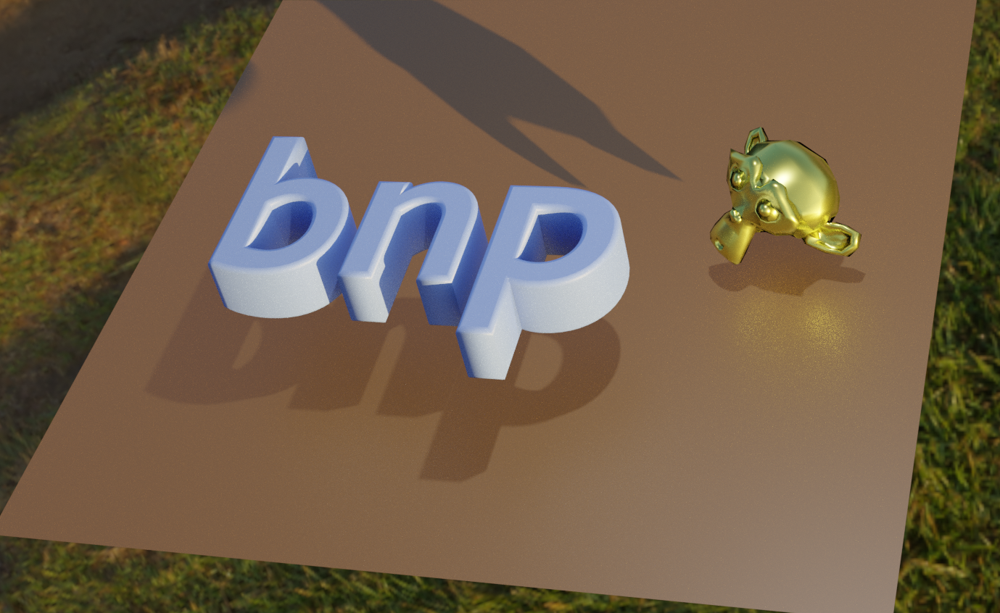

:github_url: https://github.com/j20232/bnp

bnp documentation
===============================

bnp is a numpy utility library for Blender.

All matrices are **Row major**.

The repository is at https://github.com/j20232/bnp.

.. toctree::
   :glob:
   :maxdepth: 1
   :caption: Notes

   notes/installation

.. toctree::
   :glob:
   :maxdepth: 1
   :caption: Package Reference

   modules/math
   modules/objects
   modules/scene

Indices and Tables
==================

* :ref:`genindex`
* :ref:`modindex`
* :ref:`search`
